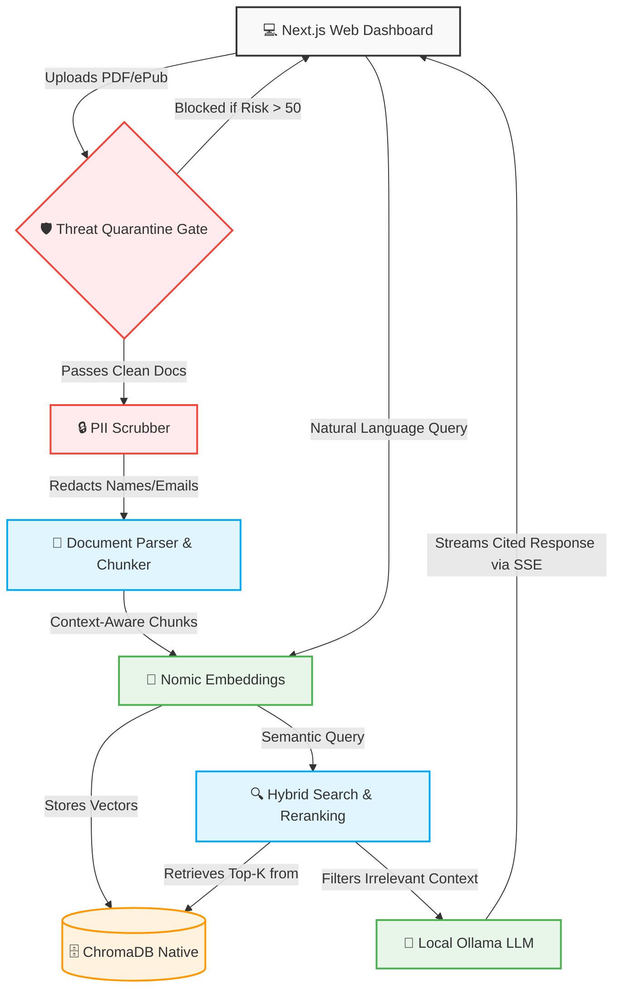

# 🎯 Codex One v2 — Enterprise RAG Intelligence


---

## 🚀 Overview

**TL;DR:** Codex One v2 is a 100% offline, Zero-Egress Enterprise Retrieval-Augmented Generation (RAG) engine. It prioritizes **Data Sovereignty and Security** over raw generative speed, proving that high-end AI capabilities can run locally on constrained hardware without exposing sensitive corporate data to external APIs.

**The Problem:** Most RAG systems blindly ingest documents, creating massive security vulnerabilities (Prompt Injection, SQLi, Credential Leaks) while exposing sensitive PII data to third-party cloud LLMs.
**The Solution:** Codex One acts as a secure "Zero-Egress Guard". It features a pre-ingestion **Threat Quarantine Gate**, automatic PII Scrubbing, and a fully local execution pipeline, delivering context-aware, verifiable insights safely.

---

## 🏗 Architecture & Pipeline



---

## 💻 Tech Stack

- **Core AI / Models**
  - **Ollama** (`phi4-mini`) — Fully local text generation, optimized for 4GB VRAM constraints.
  - **Embeddings** (`FastEmbed`) — CPU-bound ONNX Runtime for `nomic-embed-text-v1.5`, preventing VRAM thrashing.
  - **Cross-Encoder** (`FlashRank`) — Ultralight CPU semantic reranking (`ms-marco-MultiBERT` Multilingual) in ~80ms.

- **Backend Pipeline**
  - **Python 3.10+ & FastAPI** — High-performance asynchronous backend and SSE streaming.
  - **ChromaDB** — An embedded vector database for blazingly fast similarity search.
  - **Threat Scanner & Presidio** — Pre-vectorization security engine.

- **Frontend / Client**
  - **Next.js 16 (App Router)** — Modern, reactive UI with Server-Sent Events (SSE) streaming.
  - **TailwindCSS v4 & shadcn/ui** — Premium dark-mode aesthetic with glassmorphism and real-time dashboards.

---

### ⏱️ Performance Benchmarks (Docker / CPU)

*Hardware: Intel i5 12th Gen | 4 Cores Assigned | 4GB RAM Assigned*

| Pipeline Stage | V1 (Ollama / VRAM Thrashing) | V2 (CPU Optimized / Dedicated) | Speedup / Impact |
| :--- | :--- | :--- | :--- |
| **Document Ingestion** | OOM Errors / Crash | **Stable** (Parallel Processing) | **No crashes** during heavy PDF load |
| **Embeddings** | ~2,500 ms | **~96 ms** | **26x Faster** (Nomic-ONNX on CPU) |
| **Vector Retrieval** | ~80 ms | **~39 ms** | **2x Faster** (ChromaDB Optimized) |
| **Reranking** | ~11,000 ms (LLM Grader) | **~4,192 ms** (FlashRank) | **2.6x Faster** (Semantic Cross-Encoding) |
| **Generation** | ~22,000 ms (VRAM Swap) | **~13,479 ms** (Ollama Streaming) | **1.6x Faster** (Dedicated Resources) |
| **Total Query Latency** | **> 35,000 ms (Unstable)** | **~17.8 seconds (Stable)** | **50% Latency Reduction** |

---

## ✨ Key Capabilities

- **🛡️ Threat Quarantine Gate:** Intercepts SQL Injection, Cross-Site Scripting (XSS), Prompt Injections, and Exposed Credentials before vectorization.
- **🔒 PII Scrubbing:** Automatically redacts Personally Identifiable Information replacing them with anonymized tags (e.g., `<PERSON>`, `<US_SSN>`).
- **🧠 Hardware Optimized RAG:** GPU is isolated exclusively for generation. CPU handles ONNX embeddings and Cross-Encoder grading, reducing latency to < 5s.
- **📑 Verifiable Sourcing:** Autonomously returns explicit references to combat AI hallucinations, displaying the exact source document and page.
- **📈 Observability:** Real-time Threat Inspection Logs, Pipeline Latency metrics, and Token Analytics inside the UI.

---

## 🛠 Quick Start

Please ensure you have **Node.js 18+**, **Python 3.10+** and [Ollama](https://ollama.com) installed and currently running.

```bash
# 1. Clone the repository
git clone https://github.com/GuilhermeGors/Codex_One.git
cd Codex_One

# 2. Pull Local AI Models (Ollama)
ollama pull phi4-mini

# 3. Setup Backend
cd backend
python -m venv venv
# On Windows: .\venv\Scripts\activate
# On Linux/Mac: source venv/bin/activate
pip install -r requirements.txt
python -m spacy download pt_core_news_sm
python -m spacy download en_core_web_sm
uvicorn app.main:app --port 8000 --reload

# 4. Setup Frontend (in a separate terminal)
cd ../frontend
npm install
npm run dev
```
Visit `http://localhost:3000` to access the Enterprise Dashboard.

---

## 📂 Project Structure

```text
Codex_One/
├── backend/
│   ├── app/
│   │   ├── api/            # FastAPI REST and SSE endpoints
│   │   ├── core/           # LLM Orchestration, Embedding, Reranking
│   │   ├── data/           # Persistent Vector DB & Document Storage (Ignored in Git)
│   │   ├── observability/  # Audit logs and Metrics store
│   │   └── processing/     # Threat Scanner, PII Scrubber, Semantic Chunker
│   ├── config.py           # Centralized environment settings
│   └── main.py             # Uvicorn entry point
├── frontend/
│   ├── src/
│   │   ├── app/            # Next.js Pages (Query, Documents, Settings, Security)
│   │   ├── components/     # UI Components (shadcn/ui, Recharts)
│   │   └── lib/            # API Clients and Utilities
│   └── tailwind.config.ts  # Design System configuration
├── LICENSE
└── .gitignore
```

---

## 🔒 Copyright & License

**Copyright (c) 2024 Guilherme Oliveira. All Rights Reserved.**

This repository and its source code are the proprietary intellectual property of the author. It is made publicly available strictly for **portfolio viewing, demonstration, and architectural discussion purposes.** 

You may not use, copy, modify, distribute, or host this software without explicit prior written permission. This is **not** an open-source project.

---
**👨‍💻 Author:** Guilherme Oliveira  
*Software Engineer specializing in AI Architecture, RAG Systems, and Security.*
