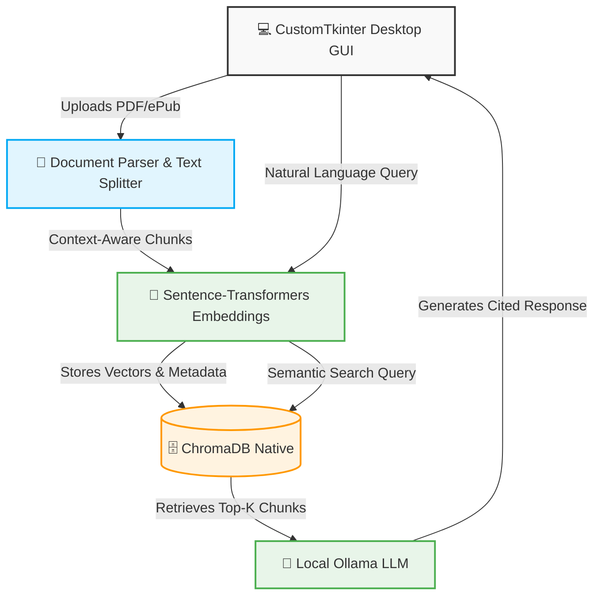

# 🎯 Codex One


---

## 🚀 Overview

**TL;DR:** Codex One is a 100% offline, privacy-first AI desktop application that lets you query your local documents (PDFs, ePubs) using natural language. 

**The Problem:** Individuals and businesses often need to extract precise information from their vast personal libraries without compromising sensitive data by sending it to third-party cloud LLMs. 
**The Solution:** Acting as your personal, fully local knowledge base grounded by a **Retrieval-Augmented Generation (RAG)** architecture, Codex One extracts answers with explicit source tracking. It ensures your sensitive data never leaves your machine while delivering context-aware, highly verifiable insights.

---

## 🏗 Architecture & Pipeline



---

## 💻 Tech Stack

- **Core AI / Models**
  - **Ollama** (`llama3:8b-instruct-q5_k_m`) — Fully local text generation and advanced natural language reasoning.
  - **Sentence-Transformers** (`all-mpnet-base-v2`) — High-precision local NLP model for generating semantic embeddings.

- **Backend Pipeline**
  - **Python 3.10+** — The core programming language defining the semantic logic orchestrator.
  - **ChromaDB** — An embedded vector database for blazingly fast similarity search.
  - **PyMuPDF / EbookLib / BeautifulSoup4** — Extensive tools for efficient multi-format document parsing.

- **Frontend / Client**
  - **CustomTkinter** — Modern, dark-mode native Python graphical user interface for seamless human-computer interaction.

---

## ✨ Key Capabilities

- **🧠 100% Offline RAG Pipeline:** Generates highly accurate answers grounded entirely on your personal documents without a single API call to external cloud providers.
- **🔍 Advanced Semantic Extraction:** Moves beyond straightforward keyword indexing to grasp the actual semantic meaning of your inquiries, effectively circumventing vocabulary mismatches.
- **📑 Verifiable Sourcing:** Autonomously returns explicit references to combat AI hallucinations, displaying the exact source document, page, or section the answer was synthesized from.
- **🛡️ Privacy by Design:** Complete data ingestion, embedding extraction, vector storage, and local model inference are structurally confined to your own hardware environment.

---

## 🛠 Quick Start

Please ensure you have **Python 3.10+** and [Ollama](https://ollama.com) installed and currently running on your local machine.

```bash
# 1. Clone the repository
git clone https://github.com/GuilhermeGors/Codex_One.git
cd Codex_One

# 2. Create and activate a virtual environment
python -m venv venv

# On Windows:
.\venv\Scripts\activate
# On macOS/Linux:
# source venv/bin/activate

# 3. Install the required dependencies
pip install -r requirements.txt

# 4. Pull and Start your local Ollama LLM model (in a separate terminal)
ollama run llama3:8b-instruct-q5_k_m

# 5. Run the Application
python main_app.py
```

---

## 🧠 AI Under the Hood

Codex One utilizes a streamlined, highly decoupled **RAG (Retrieval-Augmented Generation)** framework designed expressly for hardware-constrained local environments:

- **Chunking Strategy:** Documents are ingested and programmatically broken into fixed chunks (1000 characters) containing a semantic overlap (100 characters). This preserves the crucial contextual integrity needed when extracting continuous logic across page boundaries.
- **Vector Retrieval:** We selected `all-mpnet-base-v2` via `Sentence-Transformers` due to its superior trade-off score; it balances high-quality semantic relationship mapping with impressive execution speed, even when CPU-bound.
- **Generation:** Integrating `Ollama` seamlessly wraps the `llama3:8b-instruct-q5_k_m` local quantization parameters. This approach delivers zero-shot adherence, commanding the LLM to retrieve and infer information strictly from the provided context chunks while maintaining an exceptionally low memory and thermal footprint.

---

## 📂 Project Structure

```text
Codex_One/
├── core/                  # Core RAG pipeline, LLM orchestration, embedding generation
├── data_access/           # Persistent storage (ChromaDB Vector DB & file system handling)
├── processing/            # Document parsing (PDF, ePub) & text chunking
├── config.py              # Centralized environment & model configurations
├── main_app.py            # CustomTkinter Desktop GUI entry point
├── requirements.txt       # Project dependencies
└── run_tests.py           # Test suite runner
```

---

## 🤝 Contributing & License

Contributions, issues, and feature requests are heavily encouraged! Feel free to check the [issues page](https://github.com/GuilhermeGors/Codex_One/issues) if you would like to contribute and improve the project ecosystem.

This project is open-source and licensed under the **MIT License** - see the `LICENSE.md` file for details.
